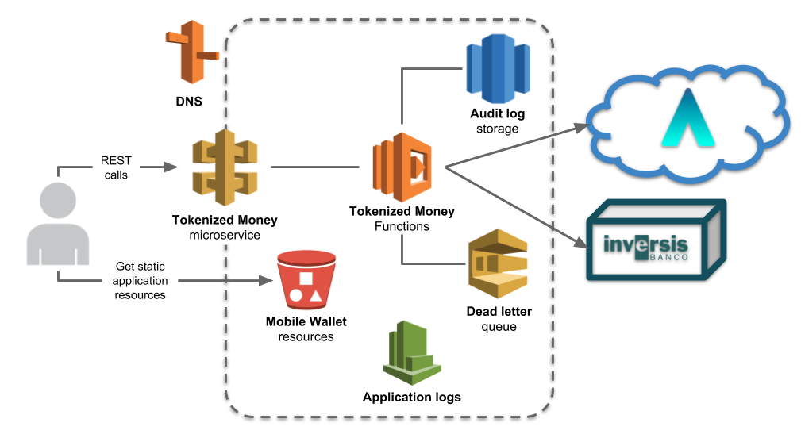

Tokenized Money PoC
===================

## Goal

The goal of this documents is response to IOBuilders Challenge based on [Tokenized Money PoC](https://github.com/Ferparishuertas/iobuilders/wiki/IoBuilders-POC).

There is a [glossary](./glossary.md), with terms and concepts used in this project.

## Architecture & technology

### C4 model

I've stated defining **architectural views** of the system, following the [C4 Model](https://c4model.com/). 

The main goal of this model is describe and comunicate architecture decissions. Also, this diagrams are a great starting point for discussions about system design during up-front sessions.

I've only used three of the four model views, because the *class diagrmas* is tightly coupled to implementtation, so change prone during development phases, then can become waste.

#### Context

In this view we define the actors (people, roles,...) involved in the system, and also we define the system boundaries. 

| Actor    | Description   
| ---------|:--------------------
| Customer | People using the system via the application. They will create tokens from fiat, and reverse. 
| Inversis | The company that will provide us banking services.

#### Containers

In this diagram we'll model the different application containers involved in the system, defining their responsabilities, as well as their technical roles.

> In this context a container is something that hosts code and/or data. The containers are the different parts of the system needs to be running in order for the overall system to work.

#### Components

> TBD

### Technology

As seen in the container diagram, this system is composed of different subsystems, each of them with different requisites, there will be more than one application architecture and technology involved. 

Let's split by application subsystem.

#### Mobile Wallet

This is the application the customers will use to interact with his/her wallet. It will be an IOS and Android mobile application. Other targets, like for example desktop, browser-based or Windows Phone, are out of scope.

We have two main scenarios: a **native** or a **hybrid/PWA** application. Each of the solution have pros and cons:

##### Native application

This applications are native to device target. Usually are built with the platform SDK. 

**PROS**

  - Platform *Look&Feel*. Better usability and UX.

**CONS**

  - Two applications to build and maintain.
  - Worst release rollout process.

##### Hybrid/PWA application

Hybrid/PWA applications are web applications that appears like native applications to the user.  

**PROS**

  - Only one application to be built.

**CONS**

  - Worst UX, because won't be native to the plafform.
  - No standard frameworks. Vendor lock-in.
  - If released vía store (Apple Store or Google Play) the release rollout process is quite similar to native applications.

##### Application architecture proposed

Taking into account other requirements, like time to market, quick wins, etc; and also related to initial team, I propose to build an Hybrid/PWA.

This applications will be composed of static resources (HTML pages, Javascript, CSS, images, etc), that will be interpreted by the browser. So, as the content is static, it can be deployed to some simple of HTTP server, or some kind of storage service, like *Amazon S3*. 

As there are a lot of Javascript frameworks and libraries,with a short release cycle, I propose to use as much standards as possible, like:

  - **[Web Components](https://github.com/w3c/webcomponents)**, to build the user interface components.
  - **VanillaJS**.

Because I'm not an expert about Web UI development, I don't have a strong possition about a Javascript framework, but I have read very good things about **VueJS**.

The deployment target can be an **Amazon S3 bucket**. In case we detect huge load, we could use **AWS CloudFront** as CDN.

#### Tokenized Money

The *microservice* owner of customer resources, in the *Tokenized Money* domain. It will be exposed as a set of REST resources vía HTTP.

The implementation of this 

> TBD

#### Wallet

> TBD

#### Identity

> TBD

#### Audit Log

###  

## Team

Based on this architectural proposition, the team should be able to:

  - Work in fon

## Culture

> TBD

## Displaimer